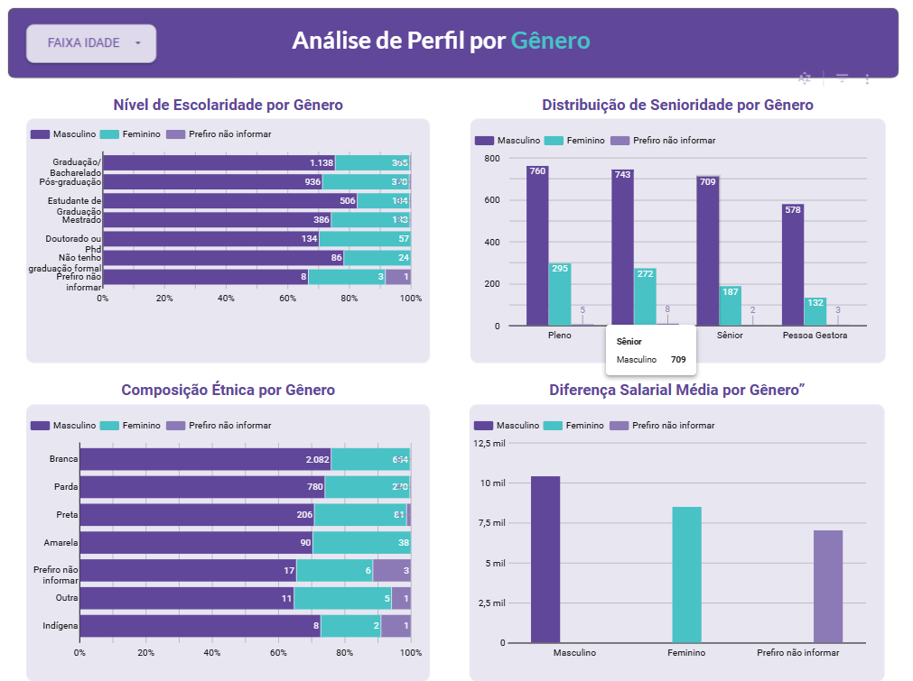
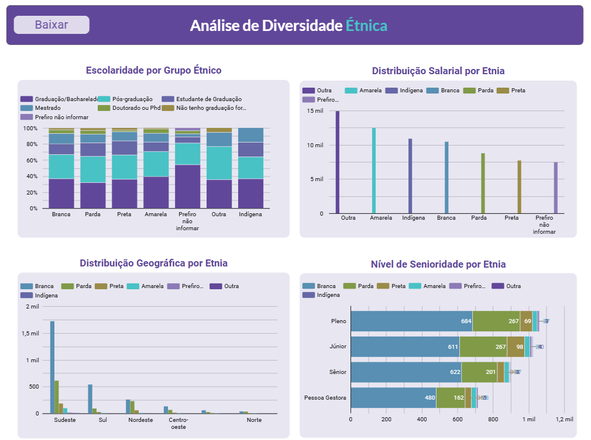

#Análise de Diversidade no Mercado de Tecnologia

Projeto desenvolvido durante o curso Eu ProgrAmo (PrograMaria).

##Dashboard
Acesse aqui: (https://lnkd.in/dhsEVtRF)

##Objetivo
Analisar dados de gênero e etnia no mercado de tecnologia.

##Ferramentas utilizadas
- Python
- SQL
- Looker Studio

##Preview

